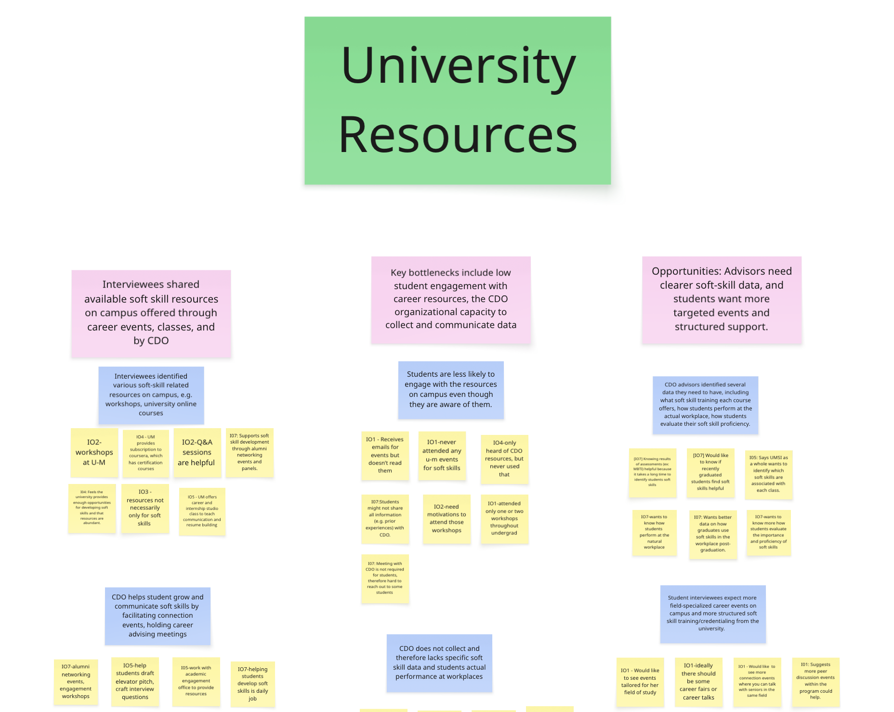

## Research Artifacts

### Interview Protocol

This interview protocol was used to conduct semi-structured interviews with two stakeholder groups:
career development advisors and graduate students. The protocol emphasizes experience-based
questioning and was designed to surface constraints around soft-skill development, measurement,
and trust in institutional tools.

### Affinity Mapping Sample

*Excerpt from the affinity mapping process synthesizing student and career advisor interviews into
key bottlenecks and opportunity areas. Lower-level coding and additional clusters are omitted for
readability.*
